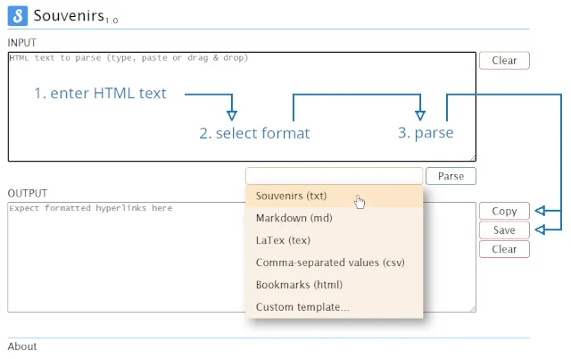

# Abstract

_[Souvenirs](https://github.com/cx2b/souvenirs "Souvenirs on GitHub")_ is a simple web application that collects anchor tag elements (hyperlinks) from any properly formed HTML document and converts the result into various template-based formats. The HTML document may be any web page source, bookmarks file or HTML fragment.

# Requirements

This is a web application, although Internet is not required -- just a modern web browser.  

# Features

### Freedoms

  * committed to respect your freedoms, including your freedom to share and change this software (see [License](#license "GNU Affero General Public License version 3 or any later version")).

### Privacy

  * committed to respect your right to privacy;
  * as far as it concerns _this_ software, nothing leaves your browser;
  * no ads, no tracking, no data collection.

### Functionality vs. User Interface

  * focus on functionality, while providing a simple, yet elegant user interface;
  * no dependencies.

### Templates

  * provides you with a curated list of templates for some of the most popular document formats and an easy to use template language to help you extend this list.

# Installation

Download the latest version, unzip it to a folder and drop the `index.html` file into a web browser.

# Documentation

For the _Souvenirs template language_ syntax and how to create custom template files, please read [_Souvenirs Template Language_](src/templates/README.md "Souvenirs template language specifications and examples").

# Changelog

More information [here](CHANGELOG.md "Versions and change history").

# Contributing

At the moment, contributing is limited to using [_Souvenirs Issues_](https://github.com/cx2b/souvenirs/issues "Souvenirs Issues on GitHub") and [_Souvenirs Discussions_](https://github.com/cx2b/souvenirs/discussions "Souvenirs Discussions on GitHub") to submit feature requests or improvements, or to report bugs.

Your feedback is always welcome.

# License

_Souvenirs_ is free software and released under the _GNU Affero General Public License version 3 or any later version_. Refer to [COPYING](COPYING "GNU Affero General Public License version 3 or any later version") for further information about licensing. If not received, see [Licenses - GNU Project - Free Software Foundation](https://www.gnu.org/licenses/ "Licenses, evaluating licenses, other resources").

 

----------------------------------------------------------------------

This file is part of _Souvenirs_ and under the _GNU All-Permissive License_.

Copyright 2024 Cristian Cezar Botez. All rights reserved.

Copying and distribution of this file, with or without modification, are permitted in any medium without royalty provided the copyright notice and this notice are preserved.  This file is offered as-is, without any warranty.
